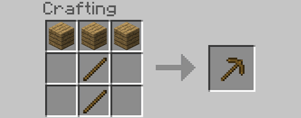

# Bodkin Storage
[Code for in-game computer that enables automated storage and crafting](main.lua).

Computer is inside Minecraft with the mods ComputerCraft ([CCTweaked](https://www.curseforge.com/minecraft/mc-mods/cc-tweaked)) and [Plethora](https://squiddev-cc.github.io/plethora/).


## Background

I wanted to challenge myself by creating a program capable of inventory management. The program would store, retrieve and craft items on command.

In the game Minecraft, one of the main mechanics is [crafting](https://minecraft.gamepedia.com/Crafting). Crafting works by having an interface with a 3x3 grid to place materials in and an output slot where the result will be. Different combinations of items in the grid will result in different results. For example, crafting a wooden pickaxe requires placing the following items in this formation:



In an unmodified copy of the game, there are close to 400 items. Keeping track of these items manually can be a task. However I was using a modified version that added many more items to the game, making inventory management into more of a chore than a fun gameplay element.

One of the modifications I am using is called [CCTweaked](https://www.curseforge.com/minecraft/mc-mods/cc-tweaked) which is a fork of a popular mod adding simple programmable computers to the game which can interact with the world around them using LUA. Using this and an [additional](https://squiddev-cc.github.io/plethora/) mod that adds more functionality to the computers, I am able to program them to move items between chests in the world.

## Setup

The image below shows the setup ingame for the system.


On the left side are chests which have 54 slots used for storing items in.

On the right are droppers, which are not intended for just storing items, but can be used for it with 9 slots each.

The furnace is used to smelt items which is needed for some crafting recipes, it has an input and output slot as well as a slot for fuel which is consumed on use.

Next to that are input and output boxes, each having 27 slots.

In the middle is the computer (or turtle). This has 16 slots and can be used as a crafting bench. It also has a wireless modem on it to receive commands from other computers.

The blocks connecting them are wires and “modems”. Which, when connected to the computer, can be programmed to move items between the different storage containers.

The code attached is the code I wrote for the computer in game.

When items are placed into the input box, they are automatically moved into the chests by the computer. If there are items of the same type in a slot that isn't yet full the items will be added to it. Else they will be moved into an empty slot. All items in the chests are tracked by a file on the computer as it is faster than checking the chests.

## Config and Cache Files

There are 2 cache files. One for [items stored](itemsStored.lua) and [another for empty slots](emptySlots.lua).
The format for the “itemsStored” file is as follows:

```
Item type
    Item variants
        Item variant 1
            Item enchantments
                Item enchantment 1
                Item enchantment 2
            Item ores
                Item ore 1
                Item ore 2
            Item damage value
            Item locations
                Item chest 1
                     Item chest slot 1 - count
                     Item chest slot 2 - count
                Item chest 2
                     Item chest slot 1 - count
                     Item chest slot 2 - count
```

Damage values are used internally by the game to store the durability of an item. For example when using a tool like a pickaxe, each time you mine a block the durability goes down by 1, and the internal damage value goes up by 1. However this value is also sometimes used to store block variants. For example the devs made different wood plank variants have the same ID as the original oak type but with different damage values.

Enchantments can be applied to some items in the game to give them extra abilities, for example a “efficiency” enchantment could be applied to a pickaxe to make it mine faster. Items can have multiple enchantments.

“Ores” is a metadata added by a [mod](https://www.curseforge.com/minecraft/mc-mods/unifier) which allows the game to accept different items in a craft recipe. For example, 2 mods might add a new material like silver to the game. This mod will detect it and assign both items the string “oreSilver”. This way is a crafting recipe in one mod would usually just accept the silver from their mod, it will now accept both. Items can have multiple ores assigned.


The other cache file defines the empty slots in the chests, it is formatted like this:
```
Chest 1
    Slot 1
    Slot 2
Chest 2
    Slot 1
    Slot 2
```


The config file named [craftingRecipies.lua](craftingRecipies.lua) Defines all the crafting recipies the computer knows.
An item can have multiple recipies which could be used to make it.
A recipe first defines the items it needs to make something (materials). These items can have their metadata specified or left as a wildcard.


Here is an example of a recipe defining "log" as a required material, saying what parameters need to be met fo it to be used.
```
["log"] = {
    itemType = "minecraft:log",
    itemOres = "*",
    itemDamage = 0,
    itemNbtHash = "*",
    itemEnchantments = "none"
},
```

A recipe also says what "workstation" is used, for most recipies this is "bench", being the 3x3 crafting grid seen at the start. The robot has a bench / crafting table built into it.


[maxItems.lua](maxItems.lua) Specifies how many items of a type to store before throwing out any new items of that type it recives.
[autoOutChests.lua](autoOutChests.lua) Says what items should always be stocked in a certian out chest / out box. (There can be multiple out boxes on the system)
[minItems.lua](minItems.lua) Is like autoOutChests.lua but specifies items that should be stocked in the internal chest bank storage. As crafting some items takes time.
[itemOres.lua](itemOres.lua) Lists all the known ores accociated with items. This file is updated with new values as items get put into the system.
[maxStackSizes.lua](maxStackSizes.lua) States how many of an item can be in one slot. For most items only 64 can be in a single slot, however for others items it is less. The value for each item type is updates on the file when it is put into the system via the in box.

## Usage

The wireless modem on the computer listens for [Rednet](https://computercraft.info/wiki/Rednet_(API)) commands.

To retrive and item from the system to an output box would use the following code:
```
rednet.send(id, {
    ["command"] = "retrive",
    ["outChest"] = "main",
    ["itemType"] = itemType,
    ["itemCount"] = count,
    ["itemOres"] = itemOres,
    ["itemDamage"] = itemDamage,
    ["itemNbtHash"] = itemNbtHash,
    ["itemEnchantments"] = itemEnchantments,
}, "bodkinStorage_1.0")
```
id is the numeric id of the computer for the storage system.
"main" is the name of the output box in the code.
itemOres and itemEnchantments are tables.
itemType, itemOres, itemDamage, itemNbtHash, itemEnchantments can be replaced with a wildcard using "\*" or by removing them from the table.
If no enchantments are wanted, itemEnchantments can be set to "none".

To count an item replace "retrive" with "count". The responce will be printed to the computer's console and broadcast on the "bodkinStorage_1.0" channel.
